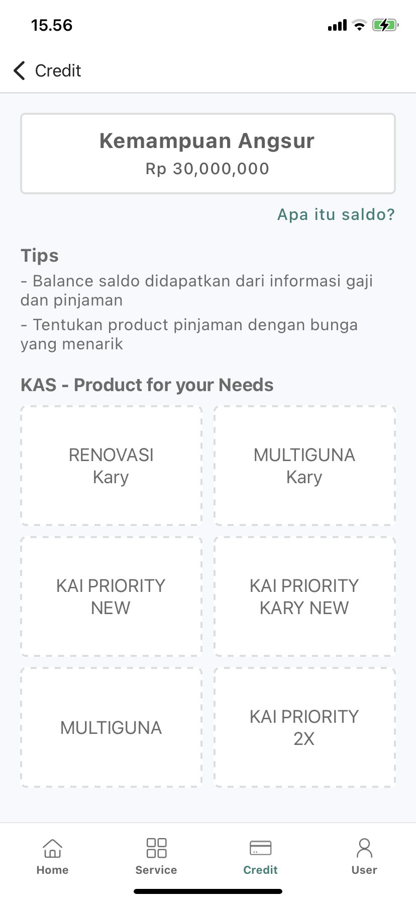
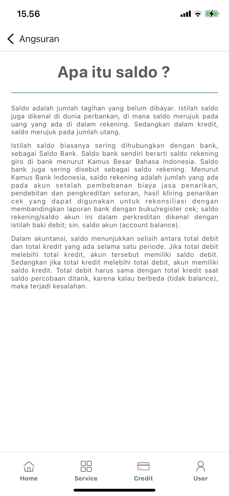
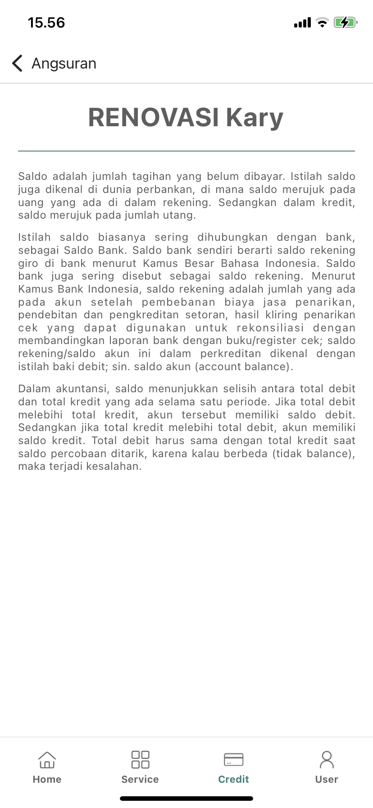
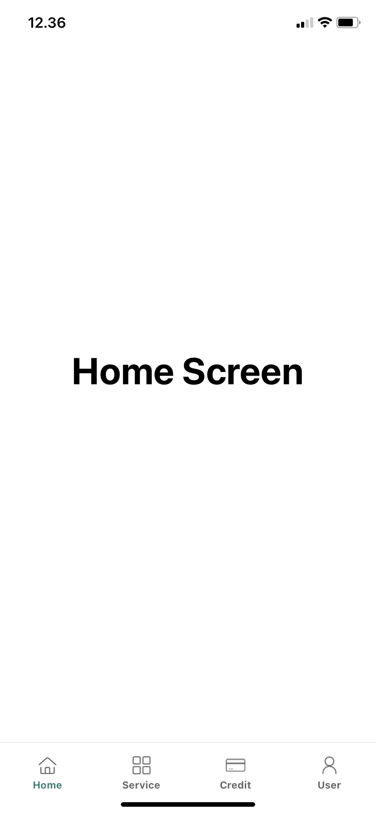
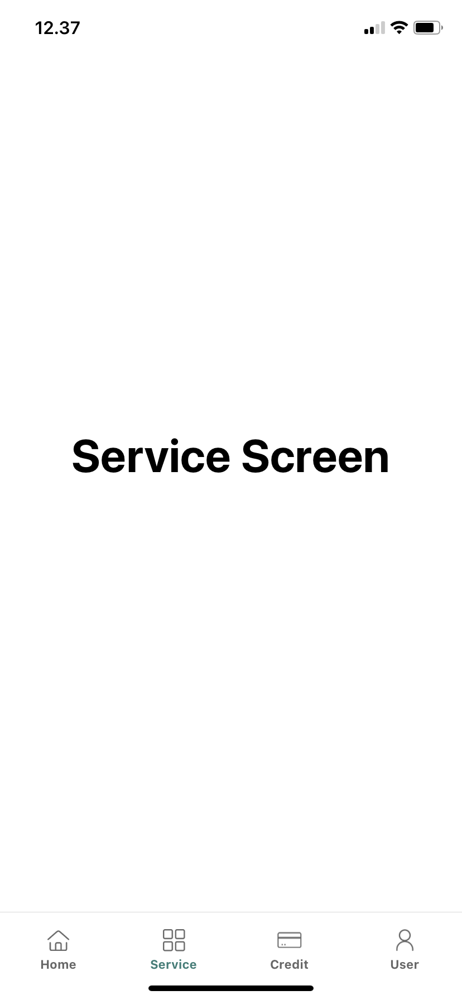
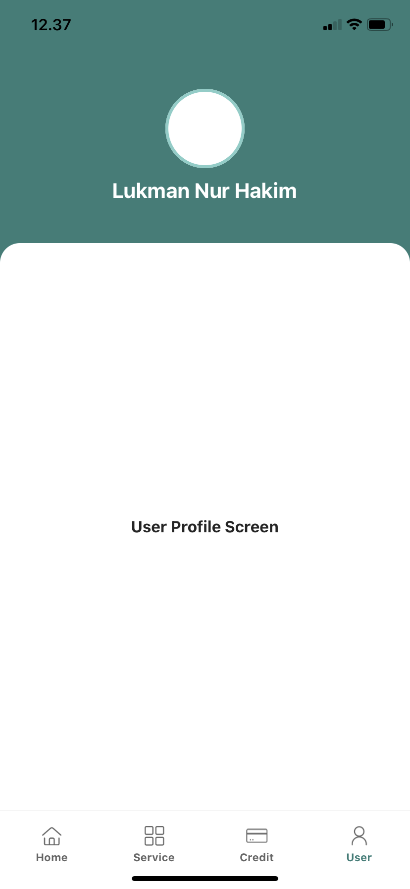

# APP UAS WEB Application

Berikut merupakan penjabaran singkat terkait soal UAS WEB Application Development nomor 3

## Project Capture

  

## Additional Project Capture

  

## Requirements

- [React](https://beta.reactjs.org) - UI framework
- [React Native](https://reactnative.dev) - cross-platform mobile framework
- [Expo](https://expo.dev) - SDK untuk mempermudah pengembangan aplikasi React Native
- [React Native Elements](https://reactnativeelements.com/) - A React Native framework for making cross platform applications
- [Yarn](https://classic.yarnpkg.com) - Dependency/Package manager
- [NodeJs](https://nodejs.org/en/download/) - Dependency

## Installation

- Clone these repository
- run `npm install --global yarn`
- run `yarn install`
- run `yarn start`
